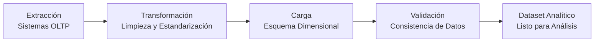

# Estudio de Caso: Analítica de Bienestar Psicoemocional Corporativo

**Componente Curricular:** Proyecto de Analítica de Datos (CPAD010)  
**Carrera:** Ingeniería en Sistemas de Información  
**Año Académico:** Quinto Año  
**Semestre:** Noveno  
**Modalidad:** Presencial / Por Encuentro  
**Versión del Documento:** 1.0  
**Fecha:** Febrero 2024  
**Créditos:** 3  
**Horas Totales:** 135

---

## Tabla de Contenidos

1. [Introducción y Contexto Empresarial](#1-introducción-y-contexto-empresarial)
2. [Formulación del Problema Analítico](#2-formulación-del-problema-analítico)
3. [Selección y Preparación de Datos](#3-selección-y-preparación-de-datos)
4. [Modelado de Datos Analítico](#4-modelado-de-datos-analítico)
5. [Visualización y Comunicación de Resultados](#5-visualización-y-comunicación-de-resultados)
6. [Consideraciones Éticas y Legales](#6-consideraciones-éticas-y-legales)
7. [Sistema de Evaluación](#7-sistema-de-evaluación)
8. [Cronograma y Organización](#8-cronograma-y-organización)
9. [Recursos y Bibliografía](#9-recursos-y-bibliografía)
10. [Instrucciones de Entrega](#10-instrucciones-de-entrega)

---

## 1. Introducción y Contexto Empresarial

### 1.1 Escenario

Una organización multinacional con presencia en España ha implementado una plataforma digital de **Bienestar Integral** para sus colaboradores. El sistema registra interacciones psicoemocionales, uso de servicios de salud mental, absentismo laboral y evaluaciones periódicas.

La dirección de Recursos Humanos ha detectado una correlación aparente entre el **ausentismo no justificado** y los **niveles de estrés reportados**, pero carece de evidencia analítica sólida para justificar una inversión mayor en programas de prevención.

### 1.2 Justificación (Tema 1: Analítica de datos en el contexto empresarial)

| Elemento | Descripción |
|----------|-------------|
| Importancia Empresarial | La salud mental de los colaboradores es un activo estratégico en entornos competitivos |
| Toma de Decisiones | La analítica transforma registros operativos en ventajas competitivas |
| Beneficios Esperados | Detección temprana de riesgos, optimización de recursos, decisiones basadas en evidencia |
| Desafíos | Datos dispersos en sistemas transaccionales, privacidad de información sensible |

> **Nota Ética:** Este caso tributa a los valores fundamentales del componente CPAD010:
> - Compromiso Social
> - Responsabilidad Social e Institucional
> - Ética Profesional
> - Equidad
> - Tolerancia y Solidaridad

### 1.3 Casos de Éxito Referenciales

- **Empresa TechCorp (Costa Rica):** Reducción del 23% en absentismo tras implementar analítica predictiva. ROI: 3.5x en programas de bienestar.
- **Organización SaludFin (Panamá):** Detección temprana de burnout en 85% de casos críticos. Mejora del 40% en retención de talento clave.

---

## 2. Formulación del Problema Analítico

### 2.1 Problema Central

La organización no cuenta con un modelo de datos analítico que integre las dimensiones laborales, psicológicas y operativas. Los datos actuales están dispersos en sistemas transaccionales (OLTP), lo que dificulta:

1. Identificar patrones de evolución del bienestar por departamento.
2. Medir el impacto real de los entrenamientos en la reducción del estrés.
3. Predecir riesgos de absentismo basados en historiales psicoemocionales.

### 2.2 Objetivo del Proyecto

> **Objetivo General:** Diseñar e implementar un **Almacén de Datos Analítico (Data Warehouse)** con un esquema dimensional que permita validar hipótesis estratégicas sobre el bienestar laboral y generar dashboards para la toma de decisiones.

### 2.3 Objetivos Específicos (Alineados con Objetivos de Aprendizaje CPAD010)

| # | Objetivo | Competencia Asociada |
|---|----------|---------------------|
| 1 | Comprender la relevancia de la analítica en el ámbito empresarial | CG-1, CG-5 |
| 2 | Desarrollar habilidades para recopilar, analizar y aprovechar datos | CE-1, CG-2 |
| 3 | Aplicar técnicas de selección y preparación de datos | CG-3, CG-4 |
| 4 | Utilizar técnicas de modelado de datos | CE-1 |
| 5 | Visualizar resultados según necesidades empresariales | CG-1, CG-4 |

*CG = Competencia Genérica | CE = Competencia Específica*

### 2.4 Alcance del Proyecto

- **Fuente de Datos:** Sistemas transaccionales legacy (simulados mediante ETL).
- **Destino:** Base de Datos Analítica (MySQL/MariaDB).
- **Esquema:** Star Schema dimensional.
- **Periodo de Análisis:** 2 años (2020-2021).
- **Población:** 500 colaboradores sintéticos.
- **Herramientas:** MySQL, PHP/Python (ETL), Power BI / Tableau.

---

## 3. Selección y Preparación de Datos

### 3.1 Fuentes Originales (OLTP)

| Tabla Origen | Descripción | Registros Estimados |
|--------------|-------------|---------------------|
| `usuarios` | Datos demográficos y laborales | 500 |
| `gt_tu_resultados` | Evaluaciones psicoemocionales | 6,000 |
| `tbllogueo` | Accesos a la plataforma | 15,000 |
| `gte_curso_usuarios` | Participación en entrenamientos | 3,500 |
| `tbl_absentismo` | Registros de ausencias | 800 |
| `gpsi_solicitud_psicologos` | Solicitudes de apoyo profesional | 1,200 |

### 3.2 Proceso ETL (Extract, Transform, Load)

